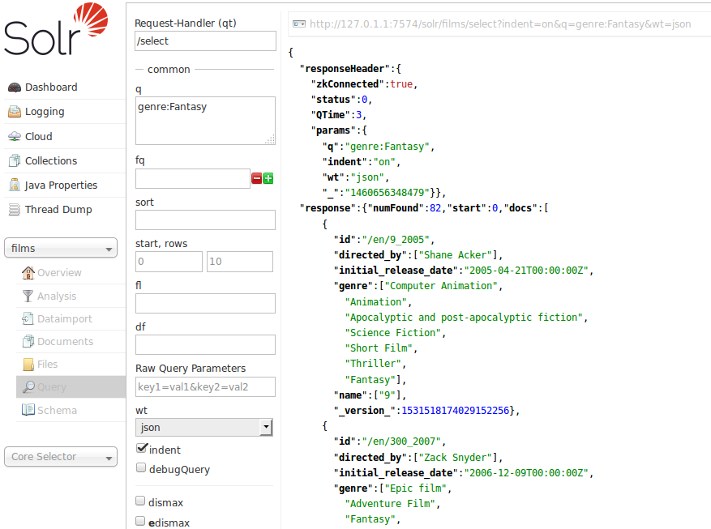

# Solr CI/CD pipeline

Deploy Solr server with CI/CD on Elestio

 
 

# Once deployed ...

You can can open Solr UI here:

    URL: https://[CI_CD_DOMAIN]
    Login: root
    password: [ADMIN_PASSWORD]

#

# Connecting

To connect from node.js you'll need the package solr-node <a href="https://www.npmjs.com/package/solr-node">here</a> then you can connect like this:

        var SolrNode = require("solr-node");

        // Create client
        var solrClient = new SolrNode({
            host: [CI_CD_DOMAIN],
            port: "443",
            core: "my_core",
            protocol: "https",
            user: "root",
            password: "[ADMIN_PASSWORD]",
        });

        // Create some data

        var data = {
            "text": 'test',
            "title": 'test'
            };

        // Parsing data
        var objQuery = solrClient.query().q(data);

        // Insert document to Solr server
        solrClient.update(data, function(err, result) {
            if (err) {
                console.log(err);
                return;
            }
            console.log('Response:', result.responseHeader);
        });

        // Searching document to Solr server
        solrClient.search(objQuery, function (err, result) {
            if (err) {
            console.log(err);
            return;
            }
            console.log('Response:', result.response);
        });

More informations <a href="https://github.com/godong9/solr-node/wiki">here</a>
